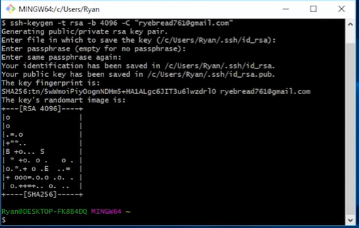
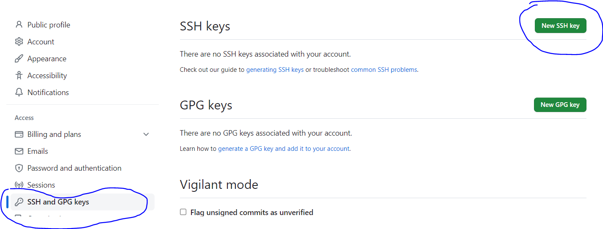

## Git and Github issues note

### SSH and GPG keys

Issue:  `git@github.com permissions denied (public key)`

Solution: `Add an SSH key`

#### Steo #1: Generating new keys
```bash
ssh-keygen -t rsa -b 4096 -C "your_email"
```
#### Steo #2: You can keep default file name and passphrase by enter 

#### Steo #3: Start SSH keygen
```bash
eval $(ssh-agent -s)
```

#### Steo #4: Add SSH key
```bash
ssh-add ~/.ssh/id_rsa
```

#### Steo #5: Copy SSH key to clipboard
```bash
clip < ~/.ssh/id_rsa.pub
```

#### Steo #6: Put SSH key into GitHub Account

<i> GitHub account > Settings > SSH and GPG keys > New SSH Key<i>
